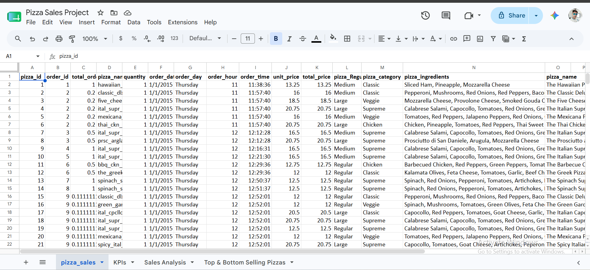
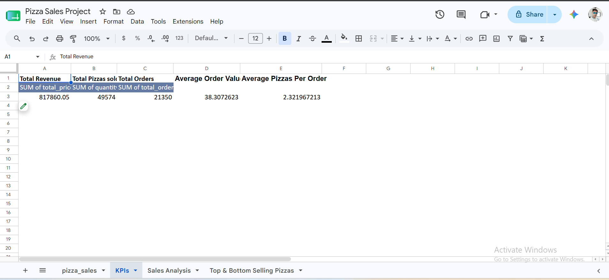
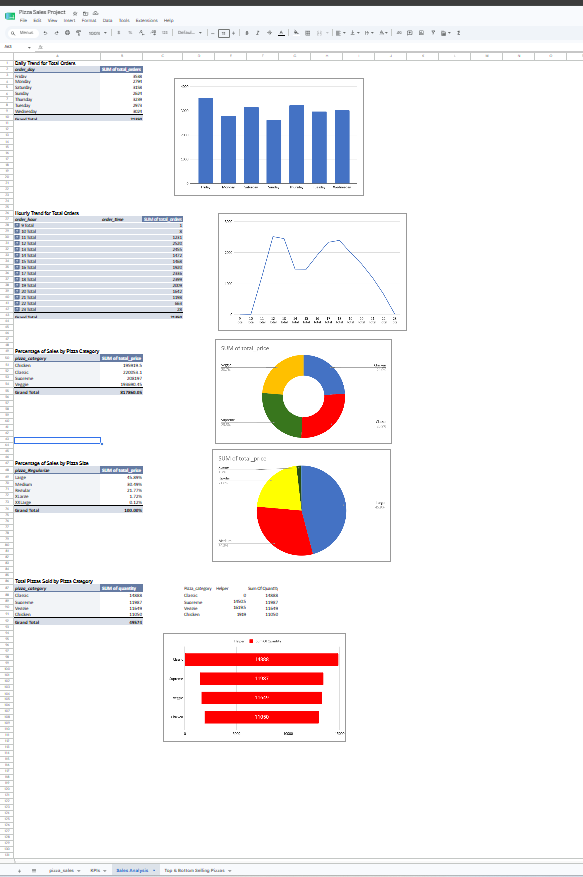
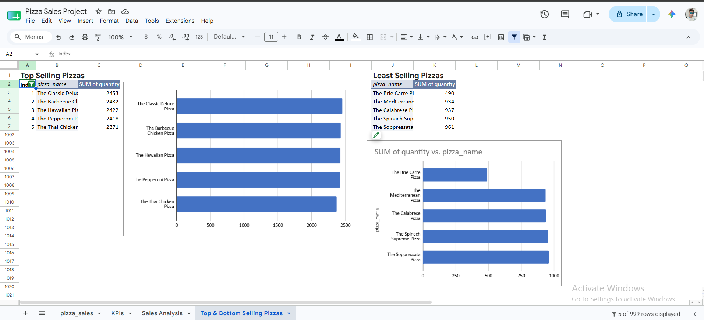

# 🍕 Pizza Sales Analysis

## 📌 Project Overview
This project analyzes a Pizza Sales dataset using Google Sheets. The analysis includes data cleaning, Pivot Tables, KPIs, and interactive charts to identify sales trends and business insights.

## 📂 Dataset
- Dataset: Pizza Sales
- Rows: 48,620+
- Format: CSV

## 🛠 Tools Used
- Google Sheets
- Pivot Tables
- Charts
- GitHub

## 📊 KPIs
- Total Revenue
- Total Orders
- Total Pizzas Sold
- Average Order Value
- Average Pizzas per Order

## 📈 Analysis Performed
- Daily Sales Trend
- Hourly Sales Trend
- Revenue by Category
- Revenue by Size
- Order Status Distribution
- Top 5 Best Selling Pizzas
- Bottom 5 Least Selling Pizzas

## 📷 Project Screenshots

### Clean Data

### KPIs

### Sales Analysis Dashboard

### Top & Bottom Selling Pizzas

## 📁 Project Files
- `pizza_sales.csv`
- `screenshots/`

## 👨‍💻 Author
**Pranav Prason**
